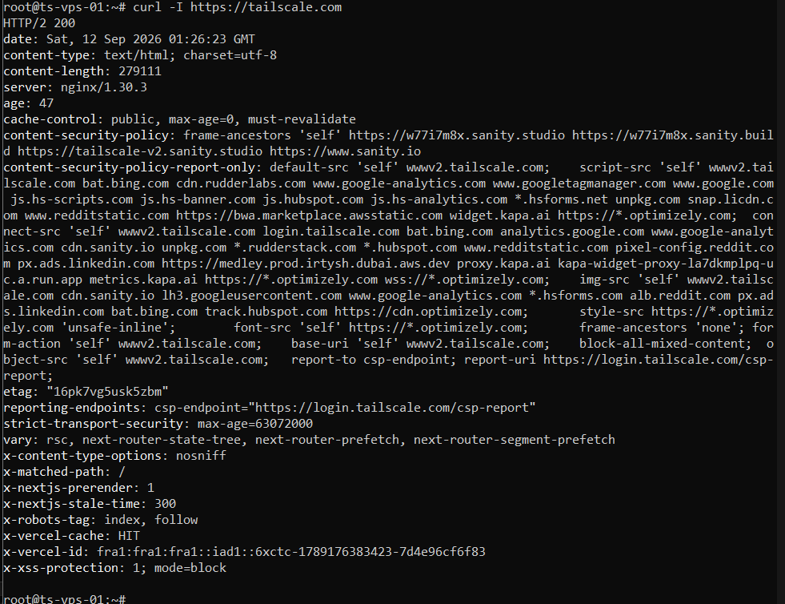

# Commands failing in the Hetzner browser console

## Issue

While setting up the VPS through Hetzner's browser console, a simple curl command failed with two errors at once:

```
curl: (6) Could not resolve host: https
-bash: //tailscale.com: No such file or directory
```

The command I typed was `curl -I https://tailscale.com`, which should have worked. No screenshot of this one — the keymap was fixed before I started capturing, so the error text is transcribed from my session.

## Environment

- Hetzner Cloud VPS, Ubuntu 24.04, Nuremberg
- Cloud firewall with no inbound rules, so no SSH access yet
- Working through Hetzner's browser-based console (out-of-band access, same idea as iDRAC or iLO on physical servers)

## Investigation

The interesting part is that one command produced two separate errors.

The first error shows curl received `https` on its own as a hostname. The second shows bash trying to execute `//tailscale.com` as a command of its own.

For bash to treat those as two commands, it had to see a command separator between them — a semicolon. So the colon I typed was not arriving as a colon.

## Cause

The Hetzner console passes raw keyboard scancodes to the VM rather than text, and the VM was using a German QWERTZ keymap. On that layout, `:` and `;` are on the same key with opposite shift states. Every colon I typed arrived as a semicolon.

Hetzner is a German provider, so the default keymap makes sense — it just does not match the physical keyboard I am typing on.

## Resolution

```
loadkeys us
```

If the command is missing, install it first:

```
apt install kbd -y
```

After that, colons and pipes typed correctly and the same curl command returned HTTP/2 200.



## Notes

The keymap does not persist. Every new console session starts on the German layout again, so `loadkeys us` has to be run each time. Once Tailscale SSH was working, this stopped mattering — SSH from my own laptop uses my own keyboard layout.

Worth remembering as a general troubleshooting pattern: when one command line produces two errors, the shell split the line. That points at the input, not at the command.
