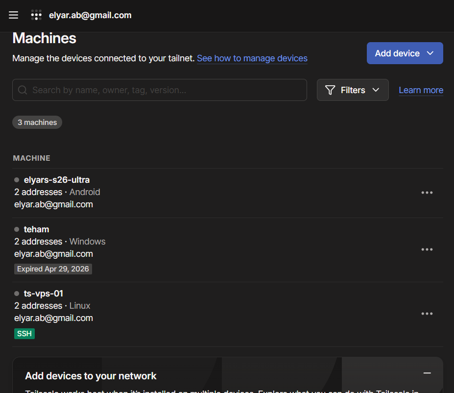

# Device showing as expired and unable to connect

## Issue

My Windows laptop (`teham`) appeared in the Tailscale admin console with a badge reading **Expired Apr 29, 2026**, and could not connect to the tailnet.



From the VPS, `tailscale status` confirmed it:

```
100.119.171.84  teham  elyar.ab@  windows  offline, last seen 3m ago
```

On the laptop itself, `tailscale status` returned:

```
# Health check:
#     - Tailscale is starting. Please wait.
unexpected state: NoState
```

## Environment

- Windows laptop, Tailscale installed and previously authenticated
- Same tailnet as my phone and my Hetzner VPS, all under one account
- The device had been signed in months earlier and then left unused

## Investigation

The laptop error message was misleading on its own — it looked like the service had simply not finished starting. But the admin console and the VPS both reported the device as expired and offline, which pointed at authentication rather than at the local service.

Both views agreed that the device was known to the tailnet but not currently allowed into it.

## Cause

Tailscale node keys expire by default after 180 days. When a key expires, the device stays listed in the admin console but drops off the tailnet until it authenticates again.

This is deliberate. It means a laptop that is lost, stolen, or simply forgotten eventually loses access on its own, without an administrator having to remember to remove it.

## Resolution

On the laptop:

```
tailscale up
```

This opened a browser window to sign in again. After authenticating, the expired badge disappeared and the device came back online with the same 100.x address as before.

## Why this matters operationally

Key expiry on a user device is a small annoyance — you sign in again and carry on.

On an infrastructure node it is an outage. If a subnet router's key expires, the routes it advertises disappear and every device that depended on them loses access to that network. Nothing obvious has changed, nothing was reconfigured, and the cause is not visible from the affected side.

So for nodes that act as subnet routers or exit nodes, key expiry should be disabled in the admin console (device menu → Disable key expiry). I did this for `ts-vps-01`.

The trade-off is the usual one: a long-lived credential is convenient and less secure. For a server under my control that is the right choice, but it is a decision worth making deliberately rather than by default.

## Comparison

This is the same failure mode as an expired TLS certificate — the service is fine, the configuration is fine, but a credential aged out and everything stops. In AWS terms it is closer to STS temporary credentials expiring mid-session.
