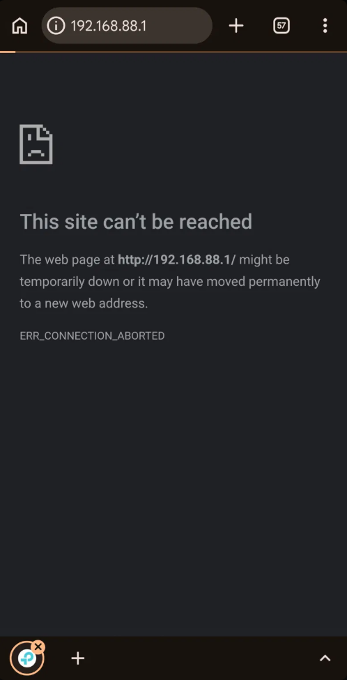
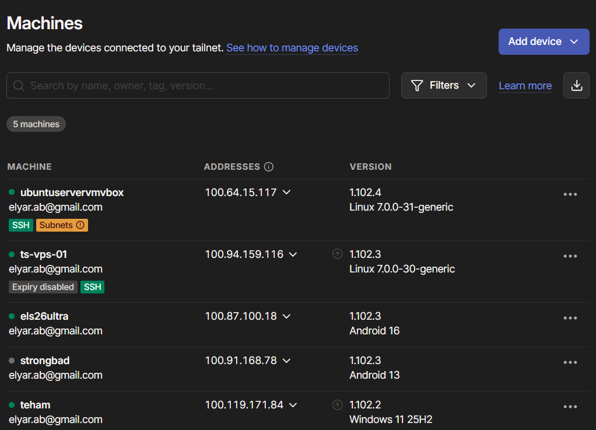
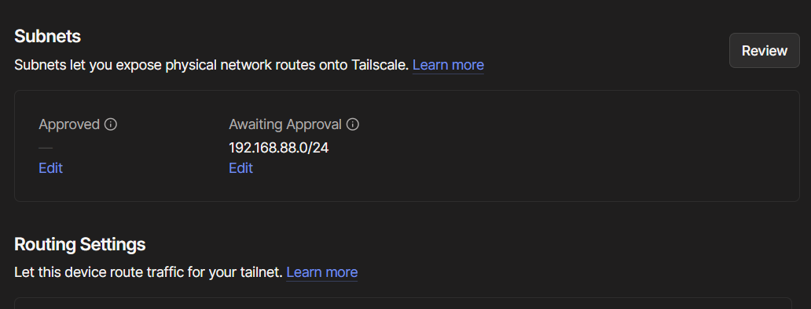
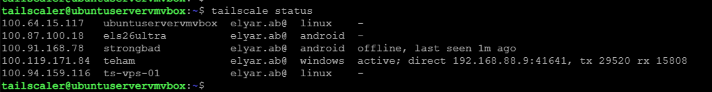
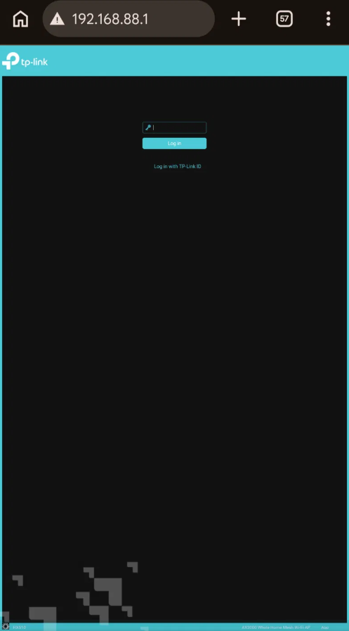

# A subnet route needs two separate things to be true


## What I was building


A subnet router: one node on my home LAN that advertises the whole network to the tailnet, so devices outside can reach things that will never run Tailscale themselves - in this case a TP-Link HX510 mesh router.


This is the same idea as a site-to-site VPN advertising a remote subnet, except only one end needs configuring. No tunnel on the router, no static routes, no matching crypto parameters on both sides.


## Environment


- `ubuntuservervmvbox` - Ubuntu Server 26.04 LTS in VirtualBox, bridged adapter, `192.168.88.14/24` on the home LAN

- `els26ultra` - Android phone, tested on cellular with Wi-Fi off so it is genuinely outside the LAN

- Target: `192.168.88.1`, the router's admin page

- Tailscale 1.102.4


## Baseline


The VM's routing table before any changes:


```

default via 192.168.88.1 dev enp0s3 proto dhcp src 192.168.88.14 metric 100

192.168.88.0/24 dev enp0s3 proto kernel scope link src 192.168.88.14 metric 100

```


The VM reaches the router locally without trouble:


```

64 bytes from 192.168.88.1: icmp_seq=1 ttl=64 time=3.03 ms

64 bytes from 192.168.88.1: icmp_seq=2 ttl=64 time=3.92 ms

64 bytes from 192.168.88.1: icmp_seq=3 ttl=64 time=3.53 ms

```


From the phone on cellular, the same address fails - no route exists, so the request has nowhere to go.





## Advertising the route


On the VM:


```

sudo tailscale set --advertise-routes=192.168.88.0/24

```


The CIDR comes straight from the routing table above. Getting the prefix length wrong here is a quiet failure - advertise a /24 on a /23 network and half the range silently does not route.


Immediately after, `tailscale status` grew a health check:


```

tailscaler@ubuntuservervmvbox:~$ tailscale status

100.64.15.117   ubuntuservervmvbox  elyar.ab@  linux    -

100.87.100.18   els26ultra          elyar.ab@  android  -

100.91.168.78   strongbad           elyar.ab@  android  offline, last seen 1m ago

100.119.171.84  teham               elyar.ab@  windows  active; direct 192.168.88.9:41641

100.94.159.116  ts-vps-01           elyar.ab@  linux    -


# Health check:

#     - Subnet routing is enabled, but IP forwarding is disabled. Check that IP forwarding is enabled on your machine.

```


And the admin console showed the route sitting in a queue rather than in effect:








So advertising a route does not enable it. Two separate things were still missing.


## Condition 1 - IP forwarding on the node


By default a Linux machine only accepts packets addressed to itself. A packet arriving on `tailscale0` destined for `192.168.88.1` gets dropped before it ever reaches `enp0s3`, because the kernel will not forward between interfaces unless told to.


This is the difference between a host and a router. The same distinction as a Layer 2 switch versus a Layer 3 switch after routing is enabled, or a Cisco device before `ip routing` - interfaces up, addresses assigned, and still nothing forwarded. In AWS it is the source/destination check attribute on an EC2 instance, which you disable for exactly this reason on a NAT instance.


```

sudo tee /etc/sysctl.d/99-tailscale.conf <<EOF

net.ipv4.ip_forward = 1

net.ipv6.conf.all.forwarding = 1

EOF


sudo sysctl -p /etc/sysctl.d/99-tailscale.conf

```


Writing into `/etc/sysctl.d/` rather than editing a central file means package updates will not overwrite it, and the file makes the setting survive reboots. `sysctl -p` applies it immediately without one.


Verified:


```

tailscaler@ubuntuservervmvbox:~$ sysctl net.ipv4.ip_forward

net.ipv4.ip_forward = 1

```


The health check disappeared from `tailscale status`.





**Tested from the phone again at this point - still failed.** That test mattered. Fixing both conditions at once would have told me nothing about which one did what.


## Condition 2 - approval in the admin console


The route was still listed as Awaiting Approval. Approving it in the admin console was the last step, and the phone reached the router immediately afterward.





Same phone, same cellular connection, different result - the only change was a route existing where one did not before.


## Why approval exists


Any node can *claim* to route any subnet. If advertising were enough, a single compromised or careless machine could announce `0.0.0.0/0` or a subnet it has no business serving, and quietly pull tailnet traffic through itself.


Approval moves that decision to the control plane, where an administrator makes it. The node proposes, the tailnet decides. It is the same separation as a routing protocol with authentication versus accepting any advertisement that arrives - and the reason BGP hijacking is a phrase that exists.


## The diagnostic lesson


The two failures announce themselves very differently.


**IP forwarding is loud.** `tailscale status` names the problem directly and tells you what to check.


**An unapproved route is silent on the node.** Nothing in `tailscale status`, no error, no log entry - the node has done its part correctly and has nothing to report. The only evidence lives in the admin console.


So a customer saying "I advertised the route and nothing happens" with a clean `tailscale status` is almost certainly the second case. Checking both the node's view and the control plane's view is the habit, because either one alone gives an incomplete picture.


## What this makes possible


The router is a TP-Link HX510 mesh AP. There is no Tailscale client for it and never will be. Same for printers, IP cameras, NAS units, switches, and most IoT devices.


One node that can run Tailscale makes all of them reachable. That is the entire argument for subnet routers, and it is why a traditional client VPN model - where every device needs the client - does not cover the same ground.


