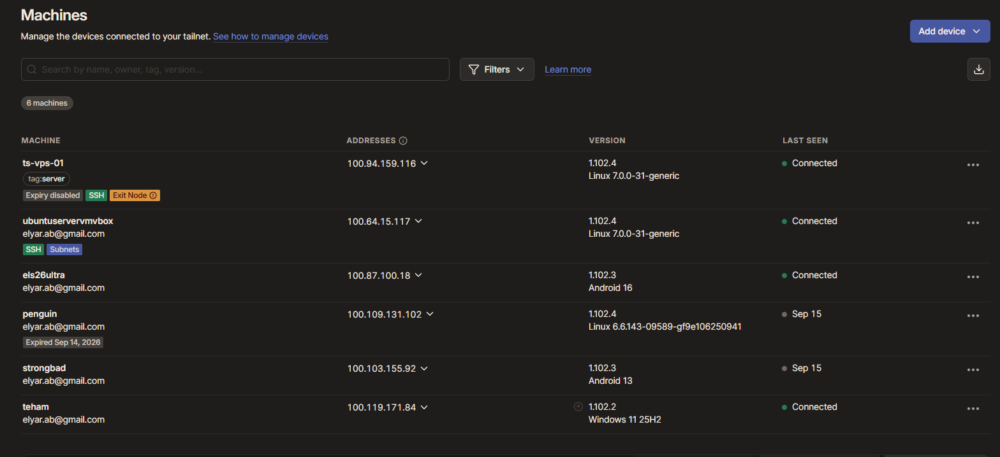
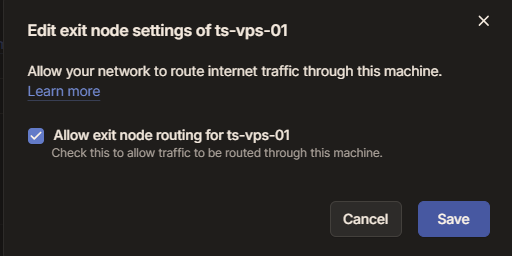
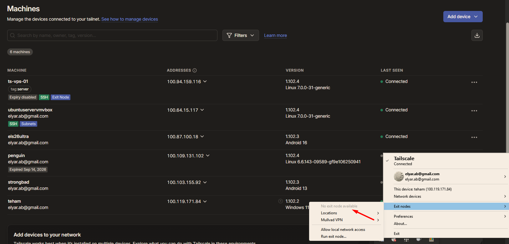
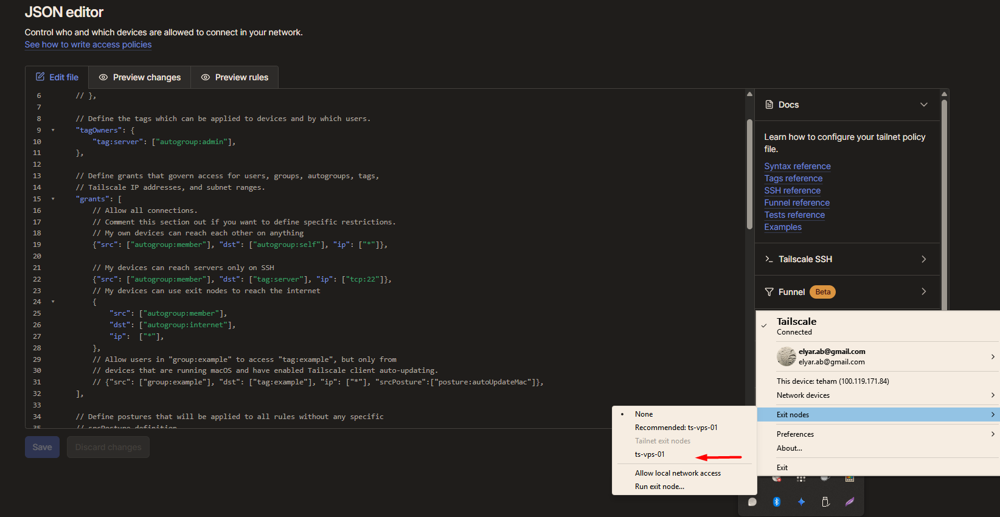

# Exit node approved, but not available to my laptop

## What I was building

Using the VPS in Nuremberg as an exit node, so all of my laptop's internet traffic leaves from Germany.

Normally Tailscale only carries traffic meant for the tailnet, and everything else goes out the normal internet connection. An exit node changes that: all internet traffic goes through one chosen node and leaves from there. It is the same difference as split tunnel versus full tunnel on a traditional VPN client.

## Environment

- `ts-vps-01` - Ubuntu 26.04 LTS on a Hetzner VPS in Nuremberg, tagged `tag:server`
- `teham` - Windows 11 laptop, on the office network
- Tailscale 1.102.x

The policy at the start was already restrictive, from an earlier session:

```
{"src": ["autogroup:member"], "dst": ["autogroup:self"], "ip": ["*"]},
{"src": ["autogroup:member"], "dst": ["tag:server"], "ip": ["tcp:22"]},
```

My own devices can reach each other on anything, and anything tagged as a server only on port 22.

## Baseline

```
PS> curl.exe ipinfo.io
{
  "ip": "<OFFICE_IP>",
  "region": "Ontario",
  "country": "CA",
  "org": "AS577 Bell Canada"
}
```

## The node

IP forwarding first, because Linux drops packets that are not addressed to itself unless told otherwise, and an exit node is a router for internet traffic:

```
tee /etc/sysctl.d/99-tailscale.conf <<EOF
net.ipv4.ip_forward = 1
net.ipv6.conf.all.forwarding = 1
EOF

sysctl -p /etc/sysctl.d/99-tailscale.conf
```

Then advertise it:

```
tailscale set --advertise-exit-node
```

No health warning this time. On the subnet router I advertised first and got a warning about forwarding. Doing it in this order avoided it.

## The console

The Machines page showed an orange **Exit Node** badge with an info icon, meaning advertised but waiting for approval:



Approved under Edit route settings:



The badge turned blue.

One thing worth noting: approving it changed nothing on any device. My laptop and phone kept using their own internet. Approval only makes an exit node available. Each device still has to choose it.

## The problem

On the laptop, the Tailscale menu under Exit nodes showed:



The VPS was configured. The console had approved it. There was no error anywhere. The option simply did not exist on the laptop.

## Cause

The policy. Grants do not only decide what traffic can pass. They also decide what each device is told about in the first place.

My two grants covered my own devices and SSH to servers. Neither one allowed internet access through an exit node. So the control plane never offered the VPS to my laptop as an exit node at all.

Under the default policy, which allows everything, this condition is quietly met, so it is easy to never notice it exists. Restricting the policy is what made it visible.

## Resolution

One more grant:

```
{"src": ["autogroup:member"], "dst": ["autogroup:internet"], "ip": ["*"]},
```

`autogroup:internet` means the internet, reached through an exit node.

After saving, the VPS appeared in the laptop's exit node list:



With it selected:

```
PS> curl.exe ipinfo.io
{
  "ip": "<VPS_IP>",
  "city": "Nuremberg",
  "region": "Bavaria",
  "country": "DE",
  "org": "AS24940 Hetzner Online GmbH"
}
```

And from the command line:

```
100.94.159.116  ts-vps-01  tagged-devices  linux  active; exit node; direct <VPS_IP>:41641, tx 5612352 rx 23004320
```

`exit node` in the status column confirms which exit node is in use. `direct` means the connection goes straight to the VPS without a relay.

Setting the exit node back to None returned the laptop to the office connection, and the status line changed:

```
100.94.159.116  ts-vps-01  tagged-devices  linux  active; offers exit node; direct <VPS_IP>:41641
```

`exit node` means this device is using it. `offers exit node` means it is available but not in use. The traffic counters also stopped growing, which confirms nothing was flowing through it anymore. When a customer pastes their `tailscale status`, that one word tells you whether they are actually on the exit node or only have one available.

## Local network access

With the exit node on, I tested whether the laptop could still reach a device on its own local network. The target was my VM, on the same network at `10.20.22.27`, and also reachable over the tailnet at `100.64.15.117`.

**Exit node on, Allow local network access off:**

```
PS> ping 10.20.22.27
Request timed out.
Request timed out.
Request timed out.
Request timed out.
    Packets: Sent = 4, Received = 0, Lost = 4 (100% loss)

PS> ping 100.64.15.117
Reply from 100.64.15.117: bytes=32 time=22ms TTL=64
Reply from 100.64.15.117: bytes=32 time=2ms TTL=64
Reply from 100.64.15.117: bytes=32 time=3ms TTL=64
Reply from 100.64.15.117: bytes=32 time=3ms TTL=64
```

**Exit node on, Allow local network access on:**

```
PS> ping 10.20.22.27
Reply from 10.20.22.27: bytes=32 time<1ms TTL=64
Reply from 10.20.22.27: bytes=32 time<1ms TTL=64
Reply from 10.20.22.27: bytes=32 time<1ms TTL=64
Reply from 10.20.22.27: bytes=32 time<1ms TTL=64
```

Same VM, three different results.

The local address failed because an exit node takes all traffic that is not tailnet traffic, and that includes addresses on the local network. The ping went into the tunnel toward the VPS instead of across the room, and that private address leads nowhere from there.

The tailnet address worked because tailnet traffic never goes through the exit node. Peers are reached directly. The exit node only changes where internet traffic goes.

Turning on local network access kept the local network out of the tunnel, and the same ping answered in under a millisecond.

The latency difference is worth noticing too. Same VM, same network: under 1 ms on the plain local network, 2 to 3 ms over the tailnet. That gap is the cost of the tunnel, the encryption and processing on both ends.

Local network access is off by default because exit nodes are mostly used on networks you do not trust, like hotel or café Wi-Fi. Sending everything into the tunnel means nothing touches that network directly. At home or in an office, where you need a printer or a NAS, you turn it on.

## Why websites saw the VPS address

The VPS rewrites the laptop's traffic so it appears to come from the VPS itself. This is source NAT, the same thing an office firewall does for every device on the way out to the internet. Here the office is one laptop and the firewall is a server in Germany.

## Why the cloud firewall needed no change

The Hetzner firewall has no inbound rules for this. Exit traffic leaves the VPS outbound, and the replies come back because they belong to connections the VPS started. A stateful firewall lets that return traffic through without any rule.

## Three conditions, and only one of them speaks

| Condition | Where it lives | What you see when it is missing |
|---|---|---|
| IP forwarding, advertised | On the node | A health warning in `tailscale status` |
| Approval | Admin console | An orange badge, only if you look |
| Policy grant | Policy file | Nothing. The option does not appear |

The first one tells you what is wrong. The second one is visible only in the console. The third one is completely silent.

## What I took away

- "I approved my exit node but it does not show up on my laptop" is a policy question first. Check for access to `autogroup:internet`.
- Approving an exit node does not route anyone through it. Each device has to select it.
- A restrictive policy exposes conditions the default policy hides. Subnet routes have the same hidden condition: the policy has to allow the subnet.
- `tailscale status` shows whether a device is using an exit node or only has one available, which is the first thing to confirm when someone says their traffic is not going where they expected.
- "When I turn on the exit node I cannot reach my printer" is a local network access question. It is off by default, on purpose.